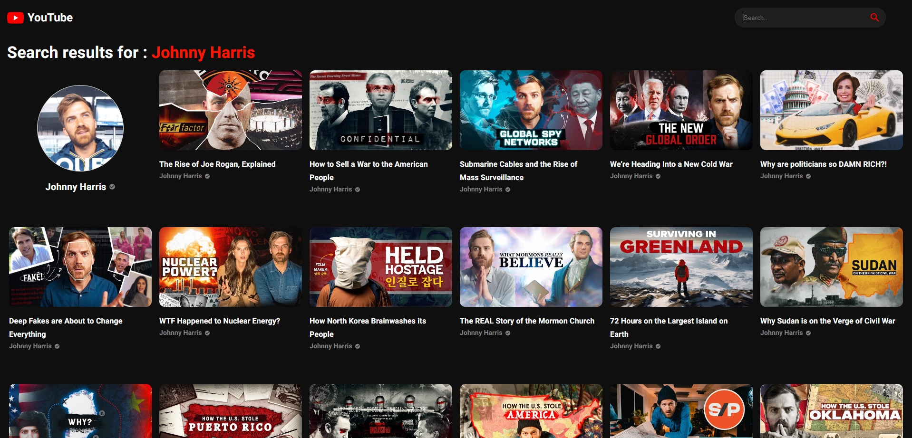
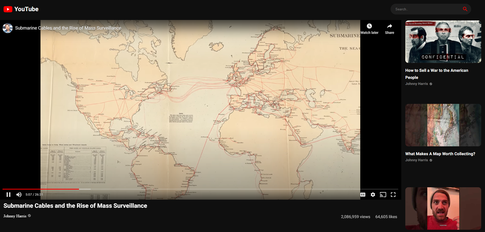

# Youtube Clone
### A Youtube Clone made using ReactJS and Youtube V3 API. Here you can watch category wise videos, search videos, get detailed channel page.
<br>

## Contributors

- [Partha](https://www.github.com/partha7978)
<br><br>

## Screenshots

| Home Page | Search Result | Video Page |
| :---: | :---: | :---: |
|  |  |  |

| Channel Page | Small Screen |
| :---: | :---: |
|  |  |


## Program Structure and Processing

I have created 5 main container components ```ChannelDetails, Feed, Navbar, SearchFeed, VideoDetail ``` and 5 sub components which will put inside those containers as ```ChannelCard, SearchBar, SideBar, VideoCard, Videos ```.  

* Inside ```Navbar```, there is logo and ```SearchBar``` component.
* Inside the ```Feed``` component, the page starts from here, this is the home page.
* There is ```SideBar``` where all the categories are displayed. Whenever you clicked on any category, the videos will be displayed according to that category in ```Video``` component. 
* Inside ```Videos```, there is ```ChannelCard```, and ```VideoCard``` component. and all the videos and channel cards will be displayed here.
* When you click on any video card, you will be redirected to the ```VideoDetail``` component. You can watch the video, and the suggested videos will be displayed here.
* When you click on any channel name, you will be redirected to the ```ChannelDetails``` component where you can view the channel details and channel videos.


## Installation

Install Youtube Clone on your local machine

```bash
  git clone https://github.com/partha7978/youtube_clone.git

  cd youtube_clone
```

### After installing on your local machine, you have to install all the packages that are used in this project.

```bash
  npm install
``` 

### To run this project on your local machine

```bash
  npm start
```

## Tech Stack

* HTML
* CSS
* JavaScript
* React
* Material UI
* Youtube V3 API
* React Icons
* React Router


### Contributions are welcome. Please open an issue or a pull request on  [GitHub](https://github.com/partha7978/youtube_clone)

<br> 

### Copyright (c) 2022 <a href="https://parthasarathimuduli.netlify.app/" target="_self">Partha Sarathi Muduli</a>